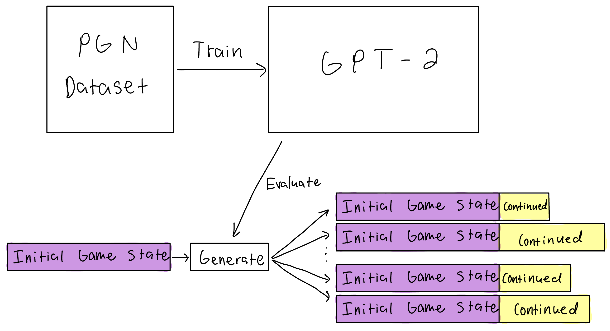

# Chessbot


## Description
This is a Chess AI that utilizes OpenAI's GPT-2 model. It learns from PGN notion available online and can predict the next moves in a game using this strategy. If trained on a large corpus of high-level play, it can predict moves that have a decent rating. While the dataset is not present in this repository, many PGN datasets can be found quickly online through a quick google search.

## How to run it
Install the dependencies by either running
```
$ pipenv install
```
if you have [`pipenv`](https://pipenv.pypa.io/en/latest/), or run 
```
$ pip install -r requirements.txt
```
if you use `pip`.
After installing the dependencies, run `python3 run.py` followed by necessary arguments. For most users, the default values should be fine, and you will just have to specify `--train` for training. <br/><br/>Make sure your training data is in text files where each line is a game in PGN notation and they are all in the `./data/` folder.<br/><br/>
When evaluating, the outputs will appear in `outputs.txt` and an initial prompt, i.e. state of the game, will be provided through the `--prompt` argument. The model will generate many different possible continuations of a game. Without specifying the initial state of a game, the model will generate many different new games. Make sure to specify the model which is going to be evaluated using the `--model` parameter.

## Limitations
The model has trouble with states of the chess board that it has not seen before, such as during the middle of the games where the likelihood of an exact configuration existing in the training dataset is unlikely. Moreover, the model tends to make illegal moves when it is unsure of positions. Possible ways to mitigate this are to increase the training data set, increase the number of parameters of the model, and to implement a system which repeatedly makes the model generate the next move until the move is legal. 

## Examples
```
$ python3 run.py --train
```
```
$ python3 run.py --train --epochs 5 --test_size 0.2
```
```
$ python3 run.py --eval --model ./models/model --prompt "1. e4 2."
```
